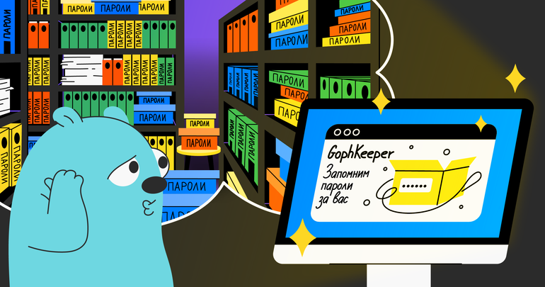

# Менеджер паролей GophKeeper

GophKeeper представляет собой клиент-серверную систему, позволяющую пользователю надёжно и безопасно хранить приватную информацию.

Типы хранимой информации:
- пары логин/пароль;
- произвольные текстовые данные;
- произвольные бинарные данные;
- данные банковских карт.

Подробное описание схемы работы приложения, в т.ч. обмена и защиты данных можно найти [здесь](docs/sheme.md).

# Запуск
Для локального запуска следует использовать Docker и предложенный Makefile:
- up-server:
  - генерирует ключ и сертификат для TLS,
  - генерирует случайный секретный ключ, используемый для подписи токенов,
  - запускает redis, postgres, mailpit (для перехвата писем от сервера) и сервер GophKeeper;
  - на порту 8025 размещает веб-интерфейс mailpit.
- run-client: создает и запускает клиент GophKeeper в папке client/cmd/.