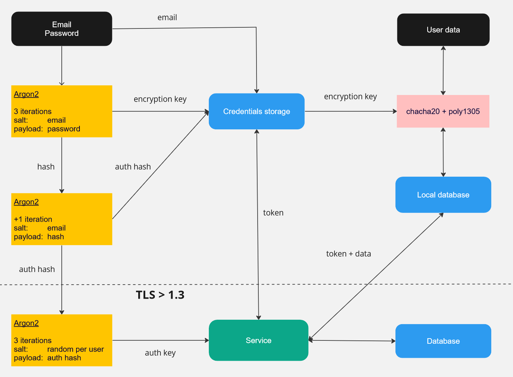

# Схема обмена данными в GophKeeper

GophKeeper представляет собой клиент-серверную систему с возможностью автономной работы клиента после успешной регистрации на сервере. 

Для нового пользователя:
- Пользователь получает клиент под необходимую ему платформу.
- Пользователь проходит процедуру первичной регистрации: вводит email и пароль в клиенте. 
- Пароль пользователя преобразуется в два хеша (Argon2): encryption key и auth hash, после чего удаляется.
- Encryption key и auth hash сохраняются в хранилище клиента.
- Auth hash и email отправляются на сервер, auth hash преобразуется в хеш (Argon2) auth key, который сохраняется вместе с email в БД.

Для существующего пользователя:
- Пользователь проходит процедуру аутентификации. 
  - При необходимости (нет токена и encryption key или auth hash и encryption key): вводит email и пароль в клиенте.
  - Пароль пользователя преобразуется в два хеша (Argon2): encryption key и auth hash, после чего удаляется.
  - Encryption key и auth hash сохраняются в хранилище клиента.
  - Auth hash и email отправляются на сервер, при успехе - пользователь получает токен и сохраняет его в хранилище.
- Пользователь добавляет/изменяет данные - данные шифруются (chacha20+poly1305) и сохраняются в локальное хранилище.
- Клиент синхронизирует данные с сервером.

Безопасность:
- Пароль пользователя не хранится нигде.
- Данные пользователя (пароли, карты, тексты и т.п.) хранятся на сервере и клиенте в зашифрованном виде.
- Encryption key хранится только у пользователя (и может быть получен из пароля). Даже владелец сервера синхронизации не сможет расшифровать данные, если захочет.
- Производный от него auth hash, который используется для аутентификации на сервере, не хранится напрямую на сервере, а сохраняется его хеш - auth key.
- Auth key использует в качестве соли случайные числа для усложения перебора по таблице при получении доступа к БД.

